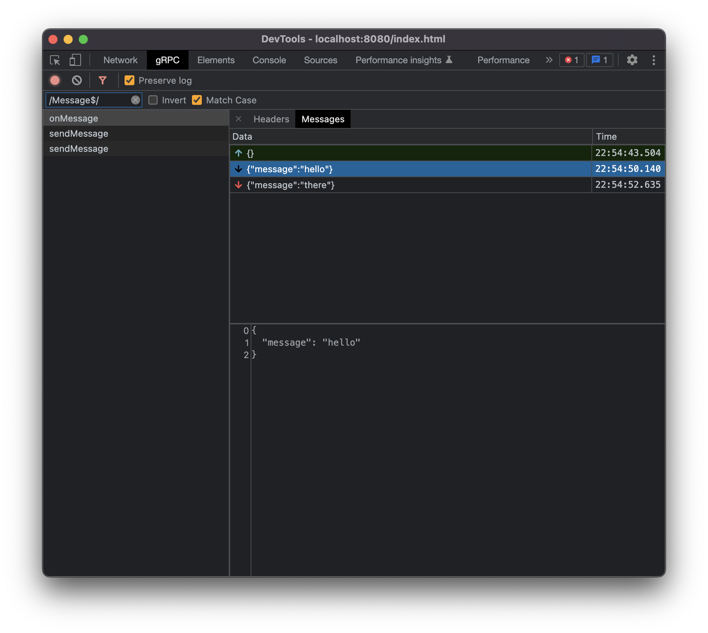

# gRPC Web Devtools

`grpc-web-devtools` requires at least [`grpc-web` 1.1.0](https://grpc.io/blog/grpc-web-interceptor/), so make sure you upgrade your grpc-web if you're still running an older one.

<div style="display: flex; justify-content: center;">
  
</div>

## Usage

grpc-web-devtools.ts

```ts
import type { StreamInterceptor, UnaryInterceptor } from "grpc-web";

declare const __gRPC_devtools__:
  | undefined
  | {
      gRPCDevtoolsUnaryInterceptor: UnaryInterceptor<unknown, unknown>;
      gRPCDevtoolsStreamInterceptor: StreamInterceptor<unknown, unknown>;
    };

export const unaryInterceptors =
  typeof __gRPC_devtools__ === "object" ? [__gRPC_devtools__.gRPCDevtoolsUnaryInterceptor] : [];
export const streamInterceptors =
  typeof __gRPC_devtools__ === "object" ? [__gRPC_devtools__.gRPCDevtoolsStreamInterceptor] : [];
```

example.ts

```ts
import { unaryInterceptors, streamInterceptors } from "./grpc-web-devtools";

const client = new ChatServiceClient(host, creds, {
  unaryInterceptors: unaryInterceptors,
  streamInterceptors: streamInterceptors,
});
```
